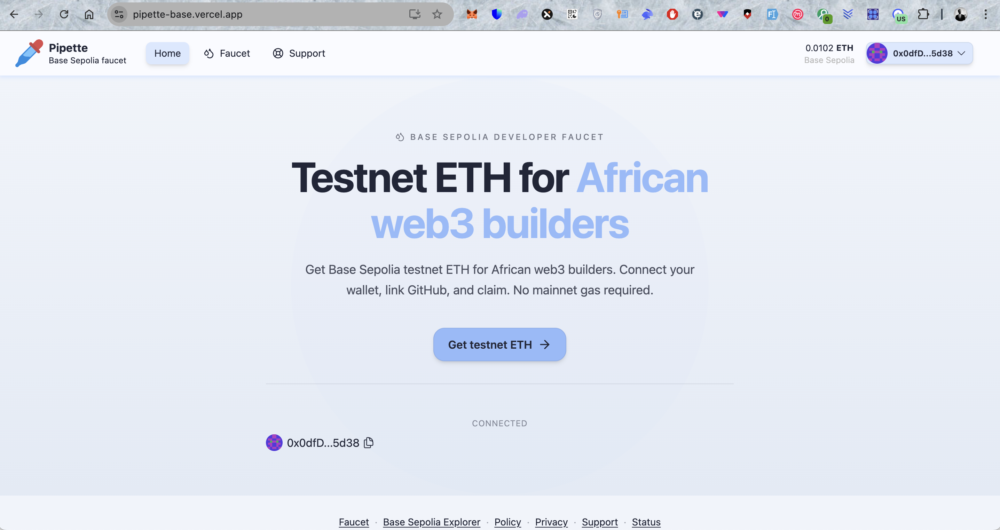
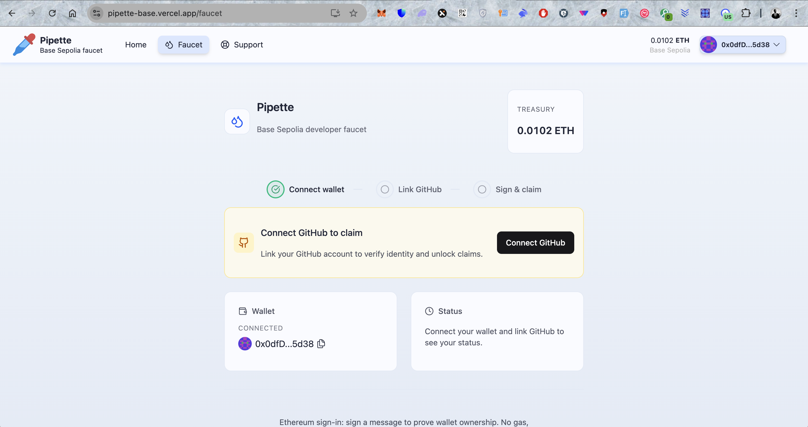
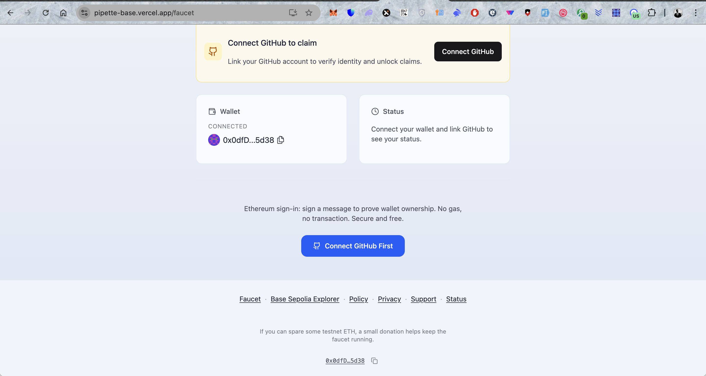
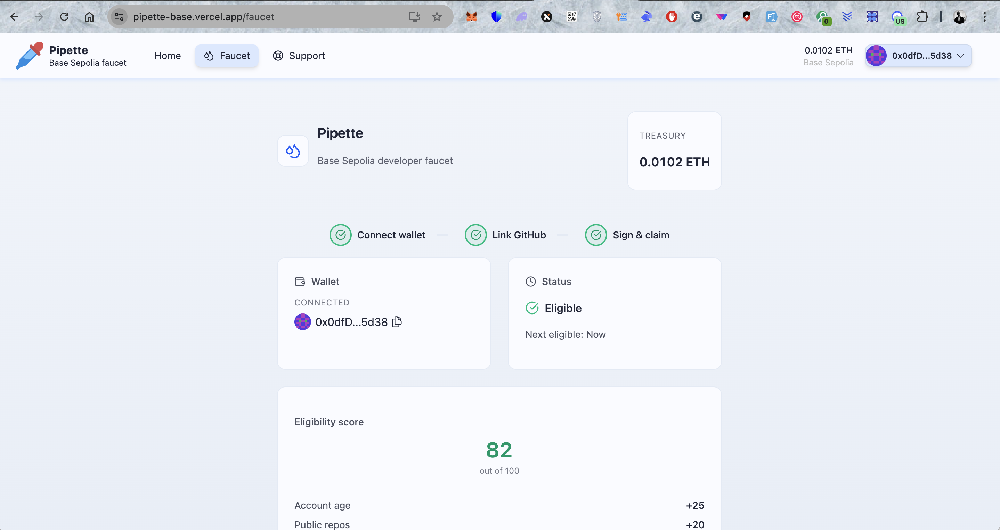
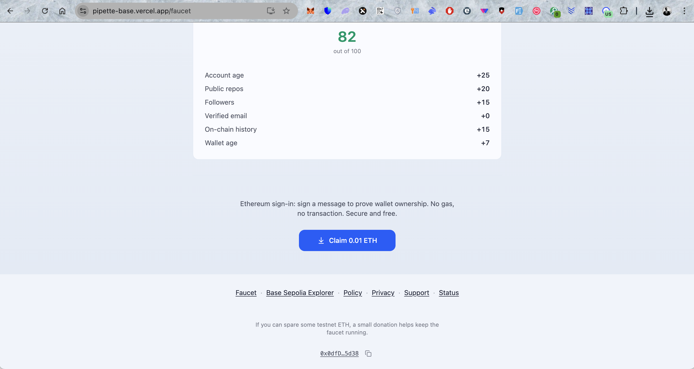
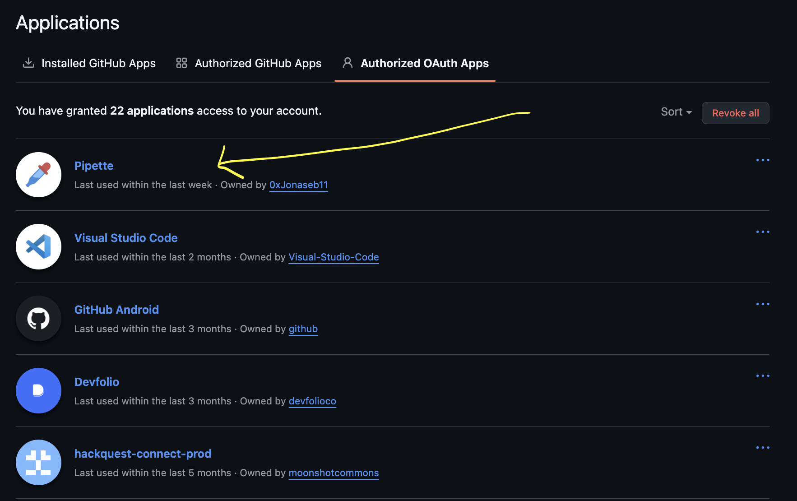

# Pipette

     

### Problem

Many testnet faucets ask you to hold or spend mainnet ETH (or other tokens) before you can get testnet funds. For early users—students, builders who haven’t earned much yet—that’s a real barrier. You want to learn and build on Base, but you can’t get testnet ETH without money you don’t have.

### What Pipette does

**Pipette** is a faucet for **Base Sepolia** testnet ETH that doesn’t require mainnet funds. You get testnet ETH so you can build and try apps on Base without spending real money.

Connect your wallet, link your GitHub account, and claim when you need it. How much you can claim depends on a simple score (e.g. verified email, GitHub link, wallet age) so the faucet can serve many people fairly. No sign-up beyond wallet and optional GitHub.

---

---

### How to use

1. **Connect** your wallet (Base Sepolia).
2. **Link GitHub** on the Faucet page to improve your score and unlock higher claim amounts.
3. **Claim** testnet ETH when you need it. Limits and cooldowns apply so the faucet can serve everyone.

For questions or issues, use the [Support](https://pipette-base.vercel.app/support) page. See [Policy](https://pipette-base.vercel.app/policy) for usage and eligibility.

---

[CONTRIBUTING.md](CONTRIBUTING.md) · [LICENCE](LICENCE) (MIT)

(c) 2026 Jonas Sebera
